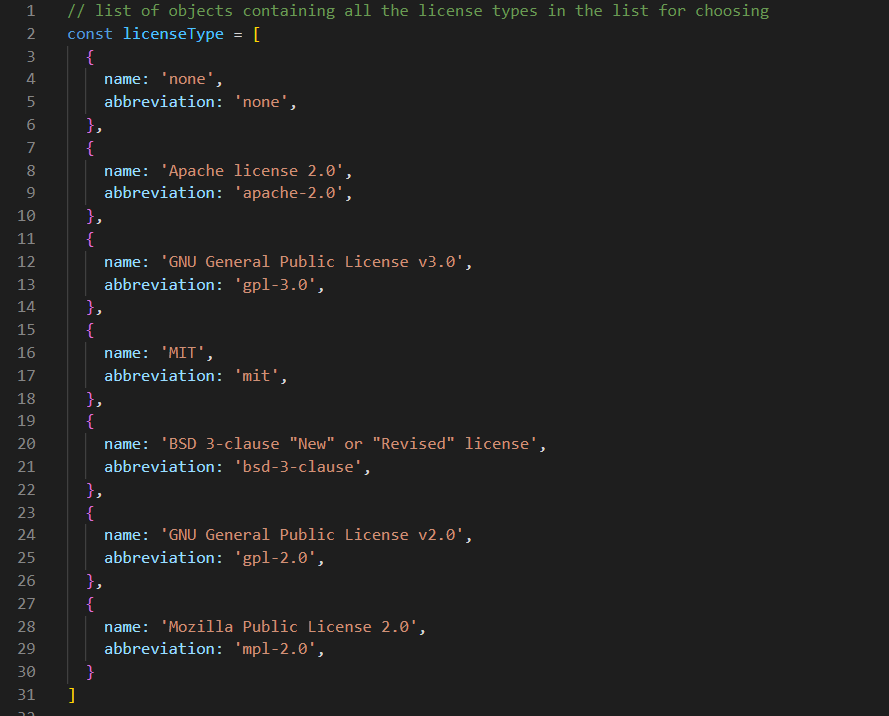

# Professional README Generator

## Description

This is an application that takes user input and generates a proffesional README file 

The user is asked questions that will generate the content of the readme.
- These questions are GitHub username, email address, Project Name, Description, license type, dependancies, test requirments, knowledge and contributing instructions
<br>

## Table of Contents

- [GitHub Link](#link)
- [Installation Instructions](#install-instructions)
- [Executing Instructions](#)
- [Video Demo](#video-demo)
---

## Link

The link to the GitHub repository of the assignment is <br>
[https://github.com/jkoufalas/Professional-README-Generator](https://github.com/jkoufalas/Professional-README-Generator)

---

## Install Instructions

The user needs to install the dependancies of the inquirer package 

```
npm i inquirer@8.2.4
```
---

## Executing Instructions

```
node index.js
```

Follow the prompts to include the information for the README

---
## Video Demo

[Link to Demo](https://youtu.be/-wKykXO7TTw)

Select the 1080p option for better resolution of text.

The demonstration video covers the following. 
- The install instructions
- How to run the application
- A walkthrough of the application and sample responses to questions.
- Where to find the README file once generated
- The contents of the README that was generated with the users input.
---

## Licence Type List

The list for the licenses is stored in a single location, this is so that if the user requires any changes to the list they would not need to change it in multiple locations and therefore reduce the liklihood of any errors.

This location is within generateMarkdown.js located in the utils folder.



Each object within the array contains a license, with the long name as 'name' and the correct abbreviation used by github and img.shields.io as 'abbreviation'.

